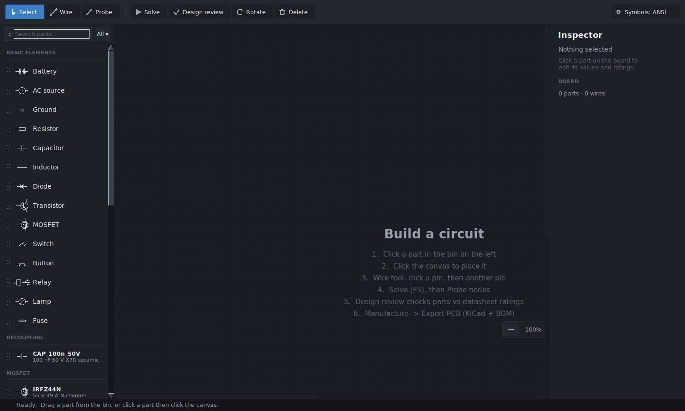
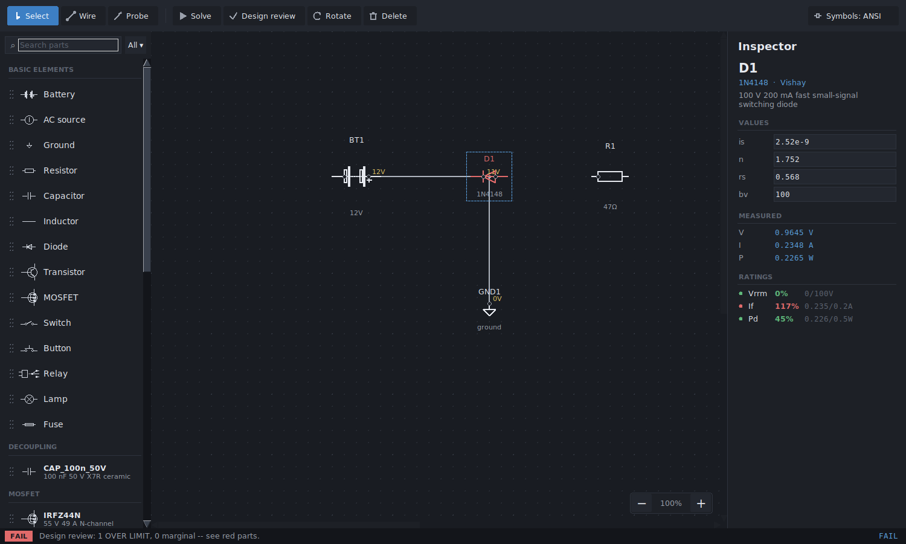
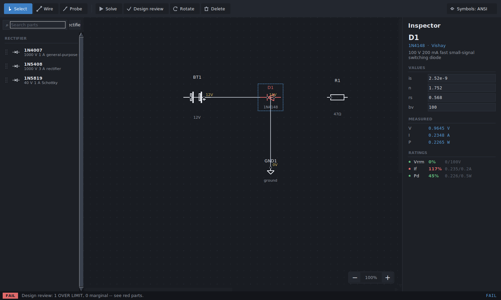
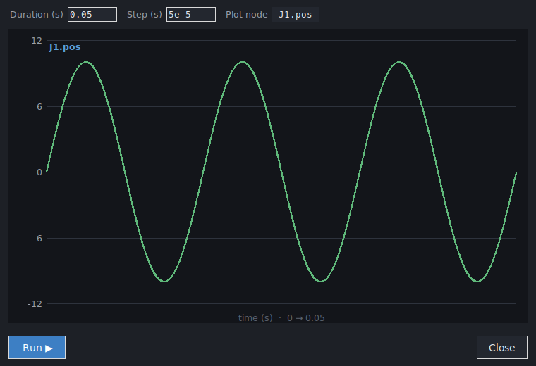
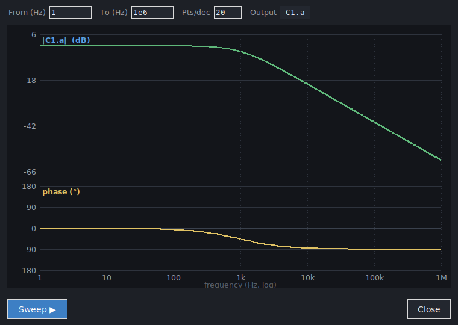
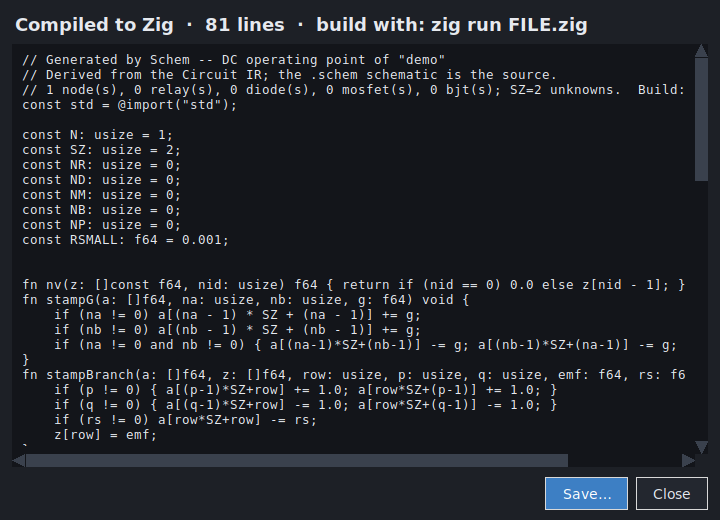
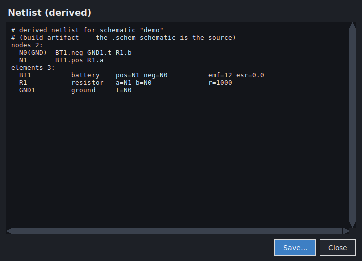
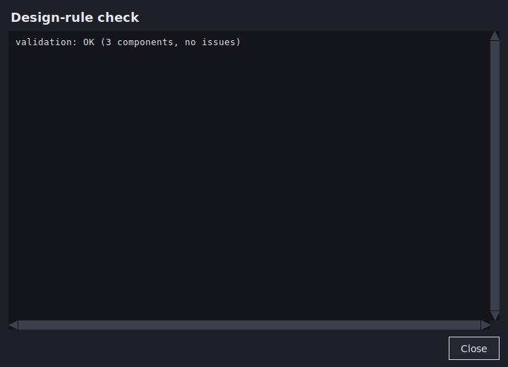
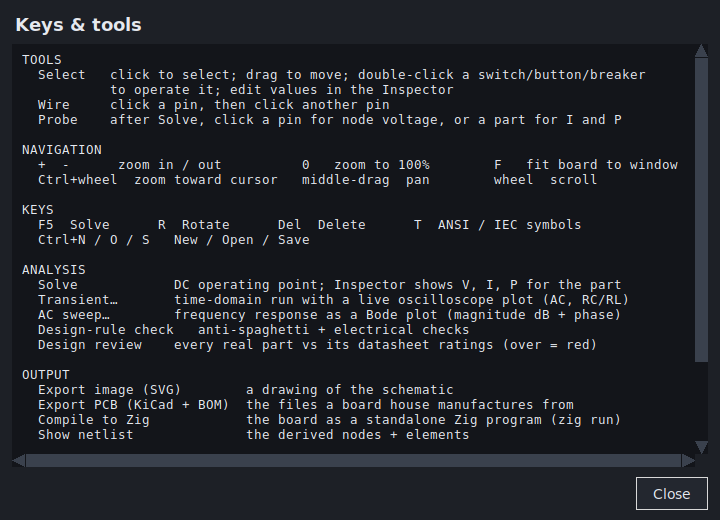

# GUI screenshots

Every screen of the Schem visual workbench (`schem gui`).  Captured from the
running Tk app.

| Screen | Image |
|--------|-------|
| Welcome / empty board |  |
| Main window — a reviewed circuit (the over-limit 1N4148 shown red; the inspector shows Values, Measured V/I/P and Ratings) |  |
| Parts bin filtered to a category (Rectifier) |  |
| Transient analysis — live oscilloscope (an AC source traced over time) |  |
| AC frequency sweep — Bode plot (RC low-pass: flat passband, −3 dB knee, −20 dB/decade rolloff, with phase) |  |
| Compile to Zig — the board emitted as a standalone Zig program |  |
| Netlist viewer — the derived nodes + elements |  |
| Design-rule check |  |
| Help — keys & tools |  |

Regenerate with the capture scripts under a virtual display
(`xvfb-run`), or just run `schem gui` and use the app.
